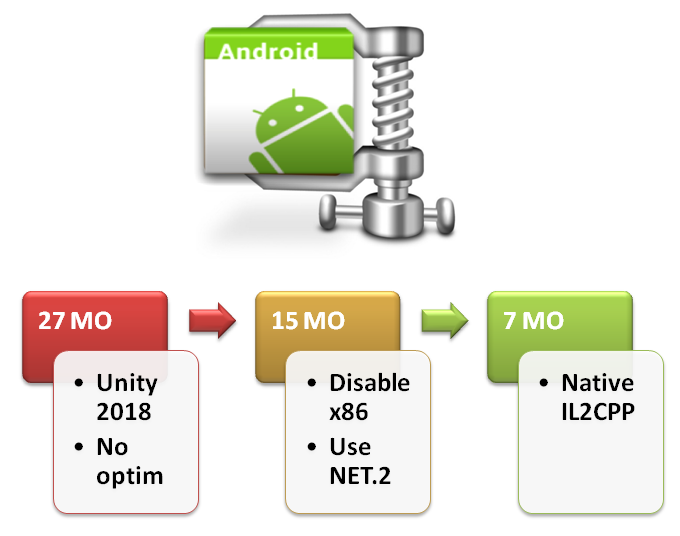
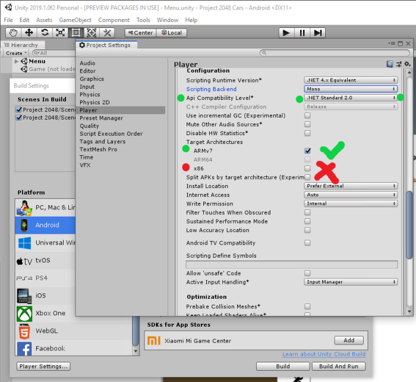
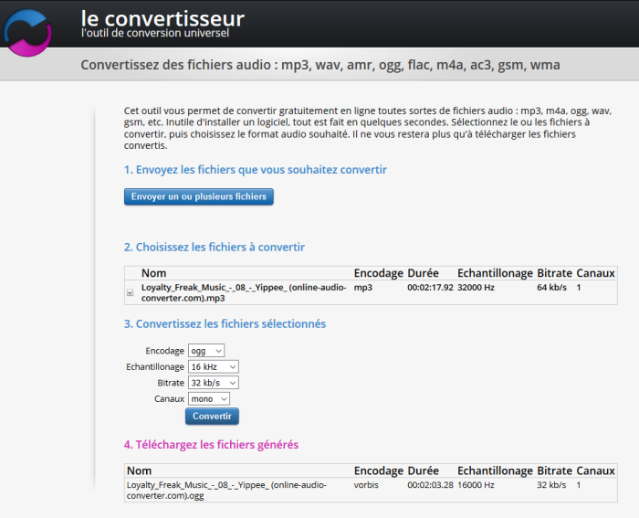
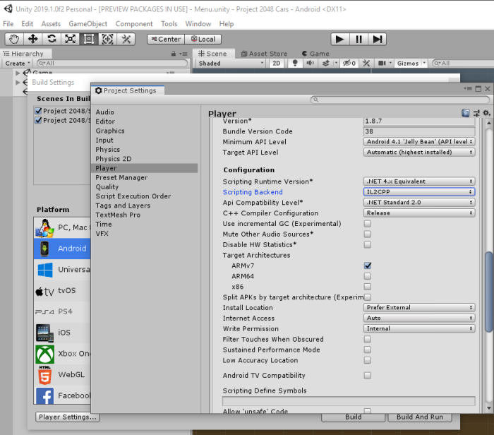
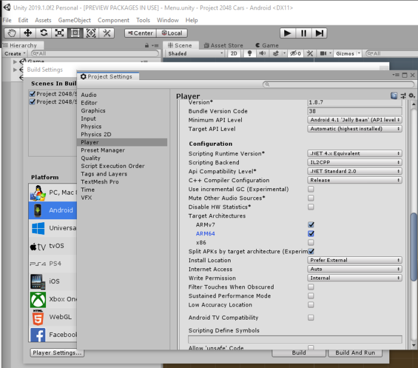

Unity3D – Reducing the APK file size of your build for mobile device
======

Keeping the file size of the built app to a minimum is important, especially for mobile devices or for app stores that impose a size limit.

Note: this article was made using Unity 2019.1

## Content

1.  Don’t expect too much from Unity
2.  Remove useless assets, models, script etc
3.  Remove the parts of the engine you aren’t using
4.  Use small size textures/images and compression
5.  If you have audio, Convert songs to ogg
6.  Enable IL2CPP native compilation
7.  Build two separate APK

## 1\. Don’t expect too much from Unity

Half of that size is taken up by the Unity engine. You won’t be able to get it much smaller and later version of Unity are bigger !!!

But no matter what you do, I doubt you’ll get a completed game smaller than ~20mb. It’s just a downside of using a game engine that has lots of features you don’t use.

Example: in 7-Zip > Open your APK file, wait, sort by Size …’lib’ use 10 mo, ‘assets\bin\Data\Managed’ 6 mo (compressed) …so that’s 16 mo for the engine in your APK, (uncompressed to compressed size is not linear, bad with lib, good with assets)

## 2\. Remove useless assets, models, script etc

It’s common sense, but it’s easy to forget some large picture or sound files in your project.

Remove any stuff you don’t need, such as scenes that are in your build but not used.

Example: in WinDirStat > menu:File > Open Folder > choose your unity3d project > Ok, Wait, Navigate to Assets folder, Check your files …maybe there are some you don’t use or need.

Example: in Unity3D > menu: Window > General > Console), click the small drop-down panel in the top right, and select Open Editor Log …you’ll see only your files in uncompressed size, so it won’t be true in your APK !!! (uncompressed to compressed size is not linear, bad with DLL, good with picture file)

## 3\. Remove the parts of the engine you aren’t using

Remove the parts of the engine you arent using instead of including all of it. Like Physics, x86 Architecture, .NET 4.x.

Unity supports two .NET API compatibility levels.: .NET 4.x and .NET Standard 2.0\. The .NET Standard 2.0 restricts you to a smaller subset of the .NET API, which can help keep size down.

Change the build to just ARM you don’t need x86\. Also check out the stripping level.

Example: in Unity3D > Menu > Build Settings > (new window) > Player Settings > (new window) > Player > Settings > ARMv7:true, x86:false, API Compatibility Level: NET Standard 2.0

## 4\. Use small size textures/images and compression

Try reducing the sizes of your assets. Use compression on images (and reduce their resolution), reduce the bitrate of any audio, especially music.

You can reduce the colour depth of images that don’t need transparency.

Example: in Photoshop > Menu > File > Save for web > PNG 8, Image Size …File size is reduce from 600 ko to 40 ko !!!

## 5\. If you have audio, Convert songs to ogg

Use a tool to convert sound files to .ogg format.

Example: [http://www.the-converter.net/fr/audio](http://www.the-converter.net/fr/audio) > ogg, 16 KHz, 32 kb/s, mono

## 6\. Enable IL2CPP native compilation

Install NDK and choose IL2CPP

Example: in Unity3D > Menu > Build Settings > (new window) > Player Settings > (new window) > Player > Settings > ‘Scripting Backend’:’IL2CPP’

## 7\. Build two separate APK

Googleplay will impose ARM64\. In the meantime, you’ll need to build for ARMv7 and ARM64\. It’s only possible with IL2CPP activated.

But ARM64, like x86, adds about 5 MO to your APK file.

Example: in Unity3D > Menu > Build Settings > (new window) > Player Settings > (new window) > Player > Settings > ‘Split APK by Archi’:true

## Resources

[Reducing the file size of your build](https://docs.unity3d.com/Manual/ReducingFilesize.html)

[How to reduce apk size?](https://forum.unity.com/threads/how-to-reduce-apk-size.493746/)

[How to reduce the size of an APK file in Unity?](https://stackoverflow.com/questions/28100362/how-to-reduce-the-size-of-an-apk-file-in-unity)

[How can we reduce apk file size in unity i made a game like flappy bird it is over 32 mb how to reduce the size .](https://www.reddit.com/r/Unity2D/comments/6jf887/how_can_we_reduce_apk_file_size_in_unity_i_made_a/)

[Performance tips for Unity 2d mobile](https://divillysausages.com/2016/01/21/performance-tips-for-unity-2d-mobile/)